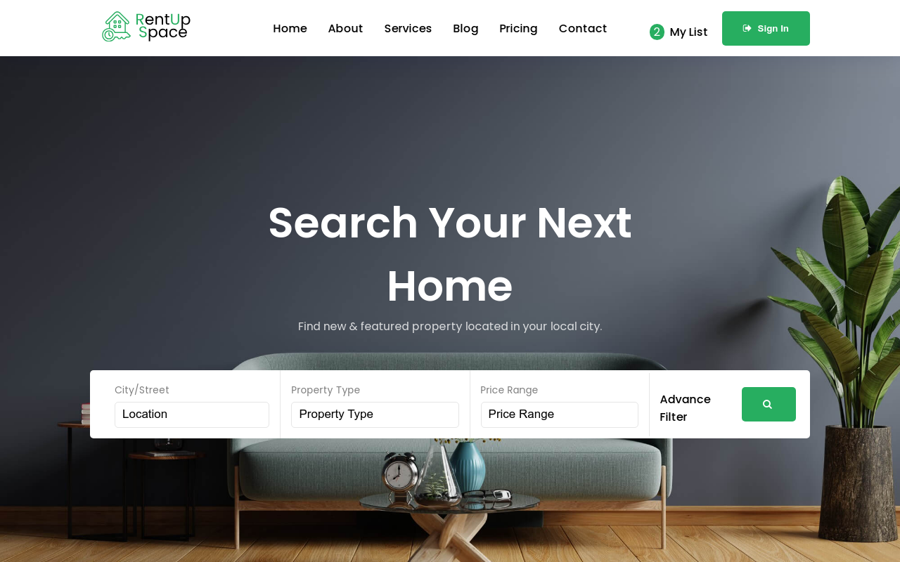

# 🏠 RentUpSpace — Real Estate Rental & Listing website

🔗 **Live Preview:** [Visit the Live Site](https://rentupspace.vercel.app/)

**RentUpSpace** is a modern property rental and real estate listing platform built with **React + Vite + TypeScript**. It allows users to search, view, and list residential and commercial properties — all through a sleek, responsive, and user-friendly interface.

## 📸 Project Screenshot

/public/images/preview.png 
```


---

## 🚀 Features

- 🏘️ Featured and recent properties display
- 🔍 Search by city, property type, and price range
- 💳 Pricing plans with multiple tiers
- 🧑‍💼 Agent profiles with contact options
- 📍 Explore by location with images and stats
- 🥇 Awards and trust badges
- ⚡ Built using Vite for blazing-fast performance

---

## 🛠️ Built With

- [React](https://react.dev/)
- [Vite](https://vitejs.dev/)
- [TypeScript](https://www.typescriptlang.org/)
- [Font Awesome](https://fontawesome.com/)
- [SCSS / CSS Modules]

---

## 🧪 Getting Started

### Step 1: Clone the repository
```bash
git clone https://github.com/jawadelachhab/real-estate-react-ts.git
cd real-estate-react-ts
```

### Step 2: Install dependencies
```bash
npm install
```

### Step 3: Run the development server
```bash
npm run dev
```

### Step 4: Build for production
```bash
npm run build
```

---

## 🙌 Support This Project

If you like this project, consider giving it a ⭐ on GitHub and following the account for more awesome projects!

[👉 Follow me on GitHub](https://github.com/jawadelachhab)  
[⭐ Star this repository](https://github.com/jawadelachhab/real-estate-react-ts)

Thank you for your support! ❤️
